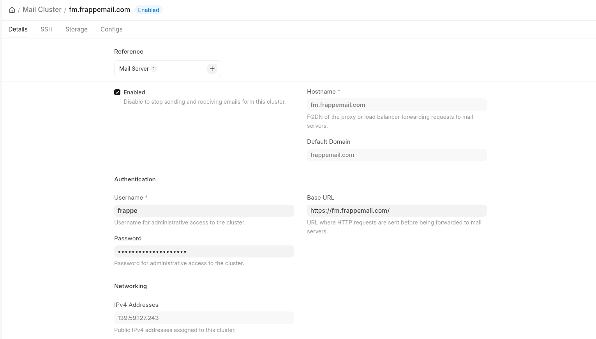
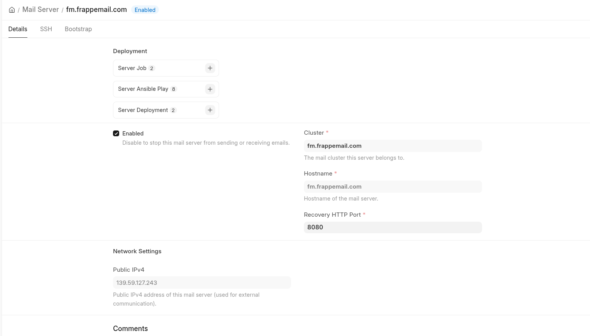
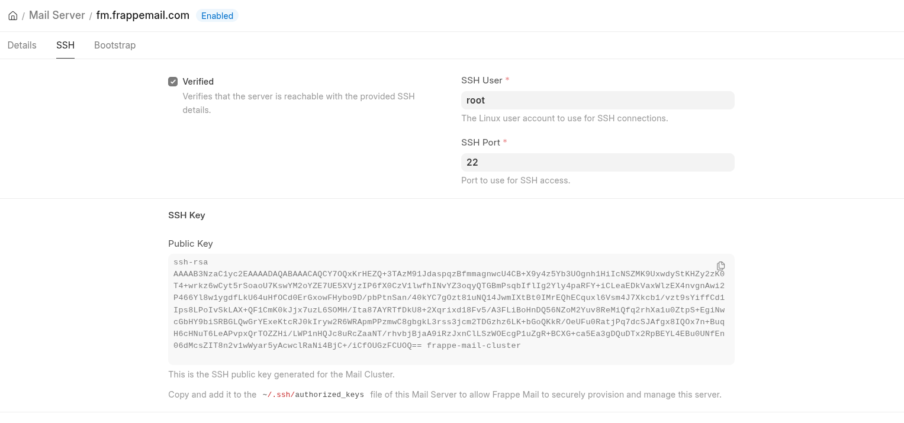
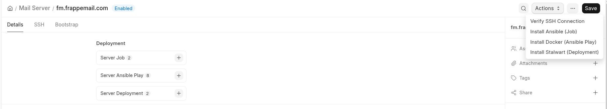
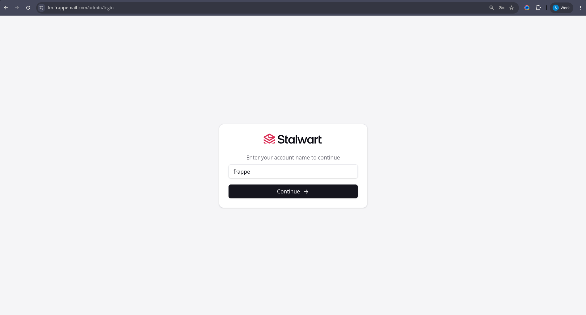

# Suite Infra

The infrastructure app for [Frappe Suite](https://github.com/frappe/suite): it deploys and manages
the servers Suite's products run on, from a Frappe site. Today that is [Stalwart](https://stalw.art)
mail servers (clusters, servers, DNS records, Ansible-driven deployments), which used to ship inside
Suite's Mail module. Other services Suite depends on, such as Meet's SFU server, are meant to land
here too.

Suite Infra and Frappe Suite are independent. Install either one alone, or both on the same site;
Suite talks to whichever servers you point it at.

## What it manages today

| DocType | Purpose |
| --- | --- |
| Mail Cluster | A Stalwart cluster: hostname, SSH keypair used to reach its servers, recovery admin, and the data / blob / search / in-memory stores that go into the bootstrap plan |
| Mail Cluster Store, Mail Cluster Store HTTP Auth | Store definitions (RocksDB, PostgreSQL, S3, ElasticSearch, Redis, ...) rendered into Stalwart's bootstrap config |
| Mail Server | A host in a cluster: SSH access, resolved IPs, generated bootstrap NDJSON |
| Server Job | Shell commands run on a server over SSH, with per-command exit codes and output |
| Server Ansible Play, Server Ansible Play Task | Ansible playbook runs (install Docker, deploy Stalwart) tracked task by task |
| Server Deployment | A Stalwart deployment: docker-compose services, env, bootstrap plan; runs the deploy playbook |
| DNS Record | Records under the root domain, pushed to and verified against your DNS provider |
| Suite Infra Settings | Root domain, DNS provider credentials, Stalwart versions, job timeouts |

Playbooks live in `suite_infra/deploy/playbooks`, the Frappe Cloud helper scripts in `suite_infra/deploy/fc`.
DNS records, server jobs, Ansible plays and the settings are service-agnostic; only the cluster, server and
deployment DocTypes are Stalwart-specific.

## Install

```sh
bench get-app https://github.com/frappe/suite_infra
bench --site yoursite install-app suite_infra
```

`ansible` must be available on the bench host (`apt install ansible`; Frappe Cloud installs it from
`pyproject.toml`). Python dependencies (paramiko, dnspython, dns-lexicon, ansible-runner) come with
the app.

## Settings

`Suite Infra Settings` (desk: `/app/suite-infra-settings`) holds:

- **DNS**: root domain name, default TTL, and the DNS provider with its credentials
  (Route53, DigitalOcean, Cloudflare, Hetzner, Linode, Namecheap, GoDaddy). Saving with changed
  credentials reads the zone's MX records once to prove they work.
- **Stalwart**: the Stalwart and Stalwart CLI versions a deployment pins.
- **Timeouts**: background job timeouts for Ansible plays, server jobs and deployments.

Every value can also be set in `site_config.json` under a `suite_infra` key; settings win when both
are set:

```json
{
  "suite_infra": {
    "root_domain_name": "example.com",
    "stalwart_version": "v0.16.16"
  }
}
```

## Moving from Frappe Suite

Sites that deployed servers through Suite keep their data:

1. Update Frappe Suite and run `bench --site yoursite migrate`. Suite's hand-over patch releases the
   deployment DocTypes: their tables and rows (clusters, SSH keys, servers, job history) stay in the
   database; only the DocType definitions are removed. On sites that never created a cluster or
   server the empty tables are dropped too.
2. `bench --site yoursite install-app suite_infra`. Installing adopts the existing tables and copies
   the root domain, DNS provider credentials, Stalwart versions and timeouts that Suite's Mail
   Settings used to hold into Suite Infra Settings.

Installing Suite Infra before Suite has migrated is refused, since both apps would then define the
same DocTypes.

## Walkthrough







## License

AGPL-3.0
